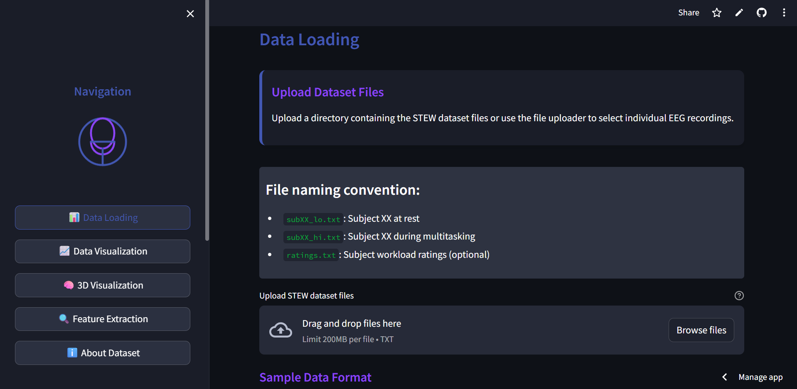

# 🧠 STEW EEG Analysis Dashboard

An interactive web application for visualizing, analyzing, and exploring EEG data from the [STEW: Simultaneous Task EEG Workload Dataset](https://ieee-dataport.org/open-access/stew-simultaneous-task-eeg-workload-dataset). Built with Streamlit and Plotly, this dashboard provides powerful tools for neuroscientific research, cognitive workload analysis, and educational demonstrations.

---

## Features

- **Data Loading & Exploration**
  - Upload and process raw EEG data files from the STEW dataset.
  - View subject workload ratings and dataset summary.
  - Interactive sample data preview and format guidance.

- **EEG Signal Visualization**
  - Plot raw EEG signals for any subject and condition.
  - Visualize power spectra and frequency band power heatmaps.
  - Compare rest and multitasking conditions.

- **3D Brain Visualization**
  - Interactive 3D brain model with standard 10-20 electrode positions.
  - Visualize electrode activity, interpolated brain surfaces, and connectivity.
  - Animated brain activity and 3D spectrograms.

- **Feature Extraction**
  - Extract spectral features (band power) from EEG windows.
  - Visualize feature distributions and class labels.
  - Ready for downstream machine learning or statistical analysis.

- **User-Friendly Interface**
  - Modern, responsive UI with custom styling.
  - Tabbed navigation and sidebar for easy workflow.
  - Rich tooltips, cards, and visual explanations.

---

## Demo



---

## Getting Started

### 1. Clone the Repository

```bash
git clone https://github.com/saumyasri123/EEG-Workload-Analysis-Dashboard.git
cd EEG-Analysis-Dashboard
```

### 2. Install Dependencies

```bash
pip install -r requirements.txt
```

### 3. Run the App

```bash
streamlit run app.py
```

The app will open in your browser at [http://localhost:8501](http://localhost:8501).

---

## File Structure

```
EEG-Analysis-Dashboard/
│
├── app.py                  # Main Streamlit app
├── eeg_processor.py        # EEG data loading and feature extraction
├── visualizations.py       # 2D visualizations (signals, spectra, heatmaps)
├── brain_visualization.py  # 3D brain and connectivity visualizations
├── requirements.txt        # Python dependencies
├── README.md               # Project documentation
└── .devcontainer/          # (Optional) VS Code dev container config
```

---

## Dataset

- **STEW Dataset:**  
  - 48 subjects, 14 EEG channels, 128 Hz sampling rate
  - Rest and multitasking (SIMKAP test) conditions
  - Workload ratings (1–9) after each session
  - [Dataset details and download](https://ieee-dataport.org/open-access/stew-simultaneous-task-eeg-workload-dataset)

---

## Example Usage

1. **Load Data:**  
   Upload your STEW dataset files (e.g., `sub01_lo.txt`, `sub01_hi.txt`, `ratings.txt`) via the dashboard.

2. **Visualize Signals:**  
   Explore raw EEG, power spectra, and band power for any subject and condition.

3. **3D Brain View:**  
   Switch to the 3D Visualization tab to see electrode positions, activity, and connectivity.

4. **Extract Features:**  
   Use the Feature Extraction tab to compute and visualize spectral features for machine learning.

---

## Research Applications

- Cognitive workload detection and monitoring
- Brain-computer interface (BCI) development
- Neurofeedback and educational tools
- Exploratory data analysis for neuroscience

---

## Requirements

- Python 3.7+
- streamlit
- plotly
- numpy
- pandas
- scipy
- matplotlib

Install all dependencies with:

```bash
pip install -r requirements.txt
```

---


## Acknowledgments

- [STEW Dataset - IEEE Dataport](https://ieee-dataport.org/open-access/stew-simultaneous-task-eeg-workload-dataset)
- [Emotiv EPOC EEG Headset](https://www.emotiv.com/epoc/)

---

